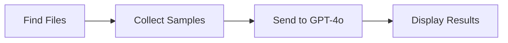

# GitHub Agents for DATS Booking Assistant

This directory contains 10 **AI-powered** agents that use GPT-4o (via GitHub Models) to provide intelligent code reviews based on the multi-agent development framework defined in `/AGENTS.md`.

## ✨ What Makes These Agents Special

Unlike traditional static analysis tools, these agents:
- 🤖 **Use GPT-4o** for intelligent, context-aware analysis
- 💬 **Provide natural language feedback** with specific code examples
- 🎯 **Understand your domain** (accessibility, DATS, POPA compliance)
- 📝 **Give actionable recommendations** with fixes you can implement

## Available Agents

| Agent | Purpose | Focus Areas |
|-------|---------|-------------|
| **🔒 Security** | Security & privacy review | Vulnerabilities, secrets, POPA compliance, PII handling |
| **✨ Code Quality** | Code maintainability | Clean code, TypeScript strict mode, DRY principles |
| **📋 PM** | Requirements analysis | User stories, acceptance criteria, accessibility requirements |
| **🏗️ Architect** | System design review | Component boundaries, scalability, MCP patterns |
| **💻 Developer** | Implementation review | TypeScript best practices, error handling, JSDoc |
| **🧪 QA** | Test coverage analysis | Missing tests, edge cases, E2E coverage |
| **🚀 DevOps** | Infrastructure review | CI/CD pipelines, secrets management, Azure deployment |
| **✍️ UX Writer** | Copy & readability | Plain language, cognitive accessibility, error messages |
| **⚖️ Legal** | Compliance review | POPA compliance, consent flows, privacy documentation |
| **♿ Accessibility** | WCAG 2.2 AA compliance | Alt text, keyboard nav, ARIA, screen readers |

## How to Use

### Option 1: GitHub Actions UI (Recommended)

1. Go to the **Actions** tab in GitHub
2. Select **"Run Agent (Manual)"** workflow
3. Click **"Run workflow"**
4. Choose an agent from the dropdown
5. Click **"Run workflow"**
6. View results in the **Summary** tab

### Option 2: Command Line

```bash
gh workflow run run-agent-manual.yml -f agent=security -f dry_run=true
gh run watch  # Watch the run
```

### Option 3: Run Locally

```bash
export GITHUB_TOKEN=$(gh auth token)
./.github/agents/scripts/security.sh
```

## Example Output

When you run the **Accessibility** agent, you get:

```
♿ Accessibility Specialist Agent
🔍 Analyzing 3 files with GPT-4o...

### Critical Issues (WCAG Violations)
1. Missing label for passcode input (WCAG 1.3.1, 4.1.2)
   Fix:
   <label for="passcode">Your Passcode</label>
   <input id="passcode" name="passcode" required>

2. Missing submit button (WCAG 3.2.2)
   Fix:
   <button type="submit">Connect</button>

### Warnings
- Placeholder text should not replace labels
- Check color contrast ratios

### Recommendations
- Add skip links for keyboard users
- Test with screen readers
```

## Setup Requirements

### For GitHub Actions

The agents need access to GitHub Models API. This is already configured via the `MODELS_TOKEN` secret.

✅ **No additional setup required!** The token is already configured in your repository.

### For Local Use

To run agents locally:

```bash
# Authenticate with GitHub CLI (one time)
gh auth login

# Run any agent
export GITHUB_TOKEN=$(gh auth token)
./.github/agents/scripts/accessibility.sh
```

## Agent Architecture

Each agent follows this pattern:

1. **Find relevant files** (HTML, TypeScript, docs, etc.)
2. **Collect samples** (2-3 files, 50-80 lines each)
3. **Send to GPT-4o** with specialized prompt
4. **Parse and display** actionable recommendations



## Multi-Agent Workflow

For complex changes, use multiple agents in sequence:

| Change Type | Recommended Agent Flow |
|-------------|------------------------|
| **New feature** | PM → Architect → Developer → Security + Accessibility + Code Quality (parallel) → QA |
| **Security fix** | Developer → Security → Code Quality |
| **UI change** | Developer → Accessibility → UX Writer |
| **Infrastructure** | DevOps → Security |

## Customizing Agents

Each agent has a specialized prompt tailored to its role. To customize:

1. Edit `.github/agents/scripts/<agent>.sh`
2. Modify the `SYSTEM_PROMPT` variable
3. Test locally before committing

Example:

```bash
SYSTEM_PROMPT="You are a security expert... [add your custom instructions]"
```

## Troubleshooting

### "No GITHUB_TOKEN" error

**In GitHub Actions**: The `MODELS_TOKEN` secret should be configured. If not, contact the repo owner.

**Locally**: Run `gh auth login` first, then `export GITHUB_TOKEN=$(gh auth token)`

### Agent runs but no output

Check that the agent is finding files:
- Accessibility: Looks for `*.html`, `*.tsx`, `*.jsx`
- Security: Looks for `*.ts`, `*.js` with auth/credential keywords
- PM: Looks for `README.md`, `PRD.md`

## Reference

- Full agent definitions: `/AGENTS.md`
- Project guidance: `/COPILOT.md`
- GitHub Models docs: https://github.com/marketplace/models
